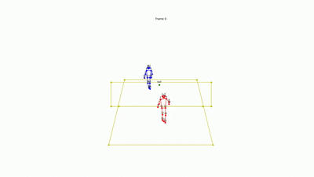

# BadmintonAnalysis

2025 《视觉感知与前沿技术》 期末大项目， 仅仅用于学习交流

## 简介

简单的羽毛球运动员姿态、场地检测工具，作为期末课程项目



## 功能特性

1. 场地检测
2. 球网检测
3. 运动员检测
4. 羽毛球检测（显示轨迹）

## 安装与使用

你可以通过以下链接下载模型权重：

👉 [Google Drive 下载地址](https://drive.google.com/drive/folders/16mVjXrul3VaXKfHHYauY0QI-SG-JVLvL?usp=sharing)

📌 **国内用户**可以使用如下网盘链接下载模型权重和 ShuttleSet 数据集：

👉 [百度网盘分享链接（提取码: u624）](https://pan.baidu.com/s/1Eo3f9RtlqxN7cLJVIoreLQ?pwd=u624)

---

### ⚙️ 文件结构配置

- 将 **模型权重文件夹（weights）** 放入 `src/models` 目录下。
- 将 **ShuttleSet 数据集文件夹** 放在项目根目录，路径为：`BadmintonAnalysis
/ShuttleSet`, `ShuttleSet` 有 `ShuttleSet` 和 `ShuttleSet22`

---

### 🧪 创建虚拟环境

```bash
conda create --name badminton_analysis python=3.9
```

### 🔌 激活虚拟环境

```bash
conda activate badminton_analysis
```

### 🚀 安装 PyTorch（支持 CUDA | MPS | CPU）

```bash
pip3 install torch==1.12.0 torchvision==0.13.0 torchaudio==0.12.0 --index-url https://download.pytorch.org/whl/cu113

pip3 install torch==1.12.0 torchvision==0.13.0 torchaudio==0.12.0 --index-url https://download.pytorch.org/whl/cpu
```

### 📦 安装其他依赖包

```bash
pip install -r docs/requirements.txt
```

### 🏸 运行程序进行球员、场地、球网检测

仅处理未处理过的视频：

```python
python main.py --folder_path "videos" --result_path "res"
```

强制处理所有视频（包括已处理的）：

```python
python main.py --folder_path "videos" --result_path "res" --force
```

---

### 🎥 绘制球场、球网、球员、羽毛球轨迹

仅处理未处理过的视频：

```python
python VideoDraw.py --folder_path "videos" --result_path "res" --court --net --players --ball
```

强制处理所有视频并绘制轨迹：

```python
python VideoDraw.py --folder_path "videos" --result_path "res" --force --court --net --players --ball --trajectory
```

---

### 🎥 绘制球场、球网、球员、羽毛球轨迹的骨架（火柴人版本）

```python
python OnlyPointDraw.py --name testX
```

X 就是数字，比如“test1”，“test2”之类的

---

### 🏷️ 参数说明（Flags）

- `--folder_path`：需要处理的视频所在的文件夹路径。
- `--result_path`：检测结果和绘图结果的保存路径。
- `--force`：是否强制处理已经被处理过的视频，`True` 表示是，`False` 表示否（默认为 `False`）。
- `--court`：是否绘制球场，`True` 表示是，`False` 表示否（默认为 `False`）。
- `--net`：是否绘制球网，`True` 表示是，`False` 表示否（默认为 `False`）。
- `--players`：是否绘制球员，`True` 表示是，`False` 表示否（默认为 `False`）。
- `--ball`：是否绘制羽毛球，`True` 表示是，`False` 表示否（默认为 `False`）。
- `--trajectory`：是否绘制羽毛球飞行轨迹，`True` 表示是，`False` 表示否（默认为 `False`）。
- `--traj_len`：设置轨迹长度（默认值为 8 帧）。
- `--name`：设置OnlyPointDraw.py 输入的视频。

## 参考项目

- [YOLO](https://docs.ultralytics.com/zh/)
- [Automated-Hit-frame-Detection-for-Badminton-Match-Analysis](https://github.com/arthur900530/Automated-Hit-frame-Detection-for-Badminton-Match-Analysis)
- [keypoint_rcnn_training_pytorch](https://github.com/alexppppp/keypoint_rcnn_training_pytorch)
- [TrackNetV2-pytorch](https://github.com/ChgygLin/TrackNetV2-pytorch)
- [TrackNetv3](https://github.com/alenzenx/TracknetV3)
- [CoachAI](https://github.com/wywyWang/CoachAI-Projects)
